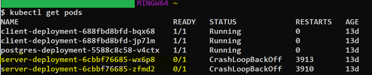
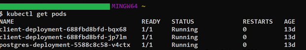
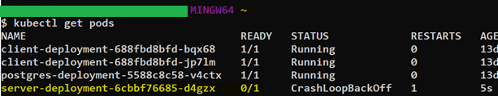
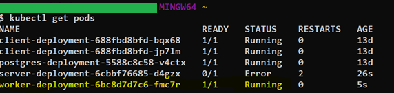

<p align="center">
  <a href="https://www.cvpcorp.com/" target="blank"></a>
</p>
 
# Kubernetes Starter Kit
 
This project will demonstrate how to set up a cluster with Amazon’s Elastic Kubernetes Service (EKS) and use kubectl commands. The yaml files in this repository configure the deployment of a web app and a postgres database. 

It will use images from [Docker Hub](https://hub.docker.com/) and deploy them to an Amazon EKS Cluster. These images are based on the [Container Starter Kit](https://github.com/CVPcorp/Container_Starter_Kit) project.
 
## Getting Started
 
These instructions will get you a copy of the project up and running using AWS services. For more information on AWS, please refer to their [documentation]( https://docs.aws.amazon.com/index.html?nc2=h_ql_doc_do_v).
 
### Prerequisites
* [Install kubectl]( https://kubernetes.io/docs/tasks/tools/install-kubectl/)
 
### Setting Up an AWS Account
Follow these steps to create an AWS account or login to an existing one.
> NOTE: AWS offers a [Free Tier]( https://aws.amazon.com/free/?all-free-tier.sort-by=item.additionalFields.SortRank&all-free-tier.sort-order=asc) account, but please be familiar with their [Pricing Model]( https://aws.amazon.com/pricing/?nc2=h_ql_pr) to avoid any additional charges.
* [Create a new AWS account]( https://portal.aws.amazon.com/billing/signup#/start).
* Enter your contact information.
* When prompted for your “Account Type,” select “Personal.”
* Enter your payment information.
  * Even if you plan to only use the free tier, Amazon requires you to enter payment information.
  * You will be charged $1 to verify the card entered. You will be refunded this amount.
* Verify your account.
* Select a [Support Plan](https://aws.amazon.com/premiumsupport/plans/).
 
### Set Up an EKS Cluster
There are two ways to set up Amazon EKS: [Console]( https://docs.aws.amazon.com/eks/latest/userguide/getting-started-console.html) or [eksctl]( https://docs.aws.amazon.com/eks/latest/userguide/getting-started-eksctl.html). This documentation will focus on using the Console.
> NOTE: Please make sure you are familiar with the [Price Model]( https://aws.amazon.com/eks/pricing/) for Amazon EKS.
* Follow the Prerequisite steps shown in the [EKS documentation]( https://docs.aws.amazon.com/eks/latest/userguide/getting-started-console.html).
  * AWS CLI
  * kubectl
  * Cluster IAM Role
  * EKS Cluster VPC
* From your AWS Management Console, search for the service “Elastic Kubernetes Service” (EKS), or go directly to the [EKS Console](https://console.aws.amazon.com/eks/home#/clusters).
* Select “Create Cluster.”
* Configure the cluster:
  * Name
  * Kubernetes version
  * Cluster service role (what you created in the prerequisite “Cluster IAM Role”)
* Specify networking:
  * VPC (what you created in the prerequisite “EKS Cluster VPC”)
  * Subnets
  * Security group (what you created in the prerequisite “EKS Cluster VPC”)
* For “Cluster Endpoint Access” select whether you want your cluster to be “Public” or “Private.”
* Review and create your cluster.
* Create a kubeconfig file:
```shell
# use AWS CLI update-kubeconfig command
aws eks --region <region> update-kubeconfig --name <cluster_name>
# test your configuration
kubectl get svc
```
> NOTE: For more information on `update-kubeconfig`, review the [documentation](https://docs.aws.amazon.com/cli/latest/reference/eks/update-kubeconfig.html).
### Deploy to Amazon EKS
This repo contains deployment and configuration yaml files for the application and a postgres database.
```shell
# this will display all deployments, pods, services, etc
kubectl get all
# deploy container 
kubectl apply -f EKS-k8s
# get all will now show the deployment
kubectl get all
```
## Scaling
Kubernetes has the ability to easily scale application deployments with kubectl commands. The yaml files determine how many pods get deployed.


### Example 1: Scaling Down/Deleting a Pod
 
There are 2 pods of the server-deployment. If one of those pods ever crash, Kubernetes will automatically spin up another pod to ensure that there are always 2 pods running

```shell
# this command displays all the pods currently running
kubectl get pods
```

<p align="left">
  </a>
</p>

As shown, there are 2 server-depolyment pods. They are crashing so Kubernetes is constantly restarting the pods. To test this further, you can use the `delete` command.

```shell
# kill 1 pod of your choosing
kubectl delete <name of pod>
# get pods will now show that pod deleted
kubectl get pods
# after a few seconds, kubernetes will have automatically spun up the pod again
kubectl get pods
```

Without editing any of the yaml files, kubectl commands can scale down the pods without Kubernetes reviving it again:

```shell
# decrease server-deployment
kubectl scale deployment server-deployment --replicas=0
```

`get pods` now shows that there are 0 server-deployment pods. 

<p align="left">
  </a>
</p>

### Example 2: Scaling up
Similar to the previous example, kubectl also has the ability to scale up. To get the server-deployment pods up and running again, use this command:

```shell
# increase server-deployment
kubectl scale deployment server-deployment --replicas=1
```

`get pods` will now show 1 server-client pods (it may take a minute for the new pod to spin up).

<p align="left">
  </a>
</p>


```shell
# increase worker-deployment
kubectl scale deployment worker-deployment --replicas=1
```

<p align="left">
  </a>
</p>

### Horizontal Autoscaling
The Kubernetes Horizontal Pod Autoscaler will scale the number of pods in deployment automatically. A minimum and maximum number of pods can be set, and then Kubernetes will add or remove pods as necessary based on the amount of resources being used. 

```shell
kubectl autoscale deployment <deployment name> --cpu-percent=50 --min=1 --max=10
```

For more information, check out these documentations:
* [AWS: Horizontal Pod Autoscaler](https://docs.aws.amazon.com/eks/latest/userguide/horizontal-pod-autoscaler.html)
* [Kubernetes: Horizontal Pod Autoscaler](https://kubernetes.io/docs/tasks/run-application/horizontal-pod-autoscale/)
 

